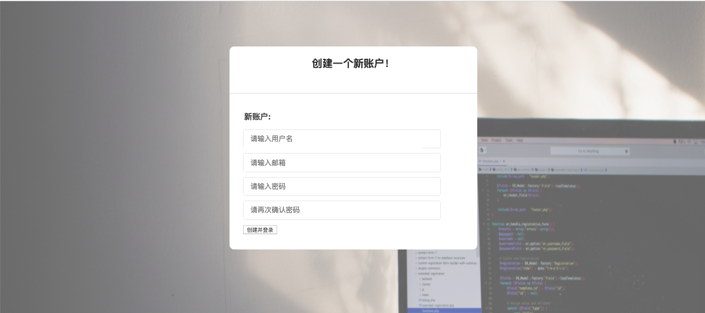
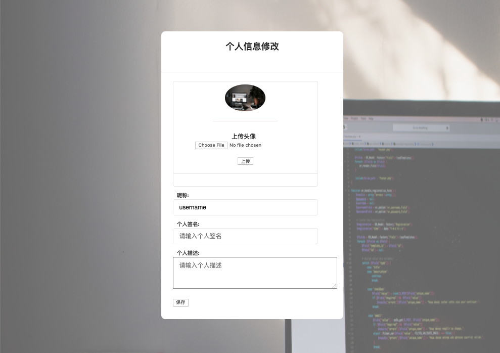
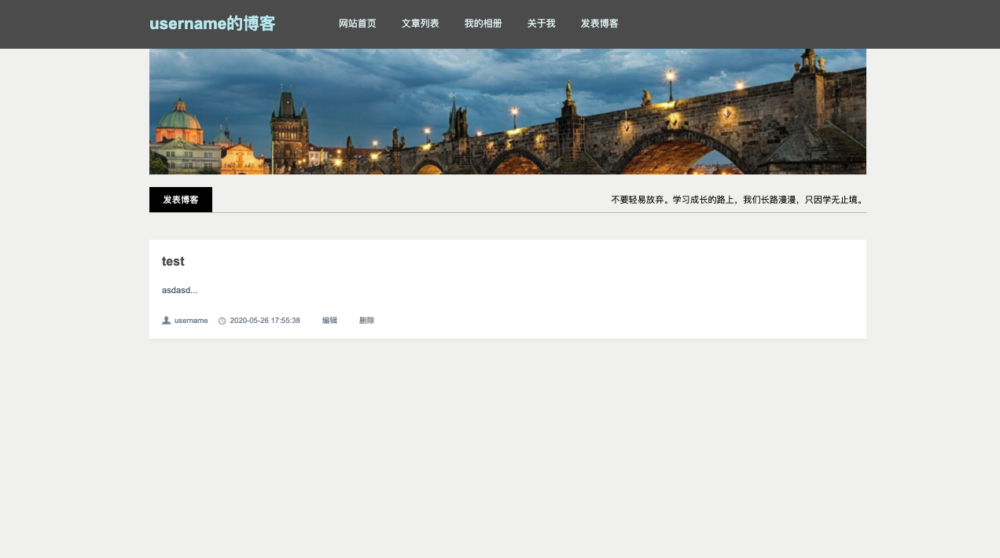
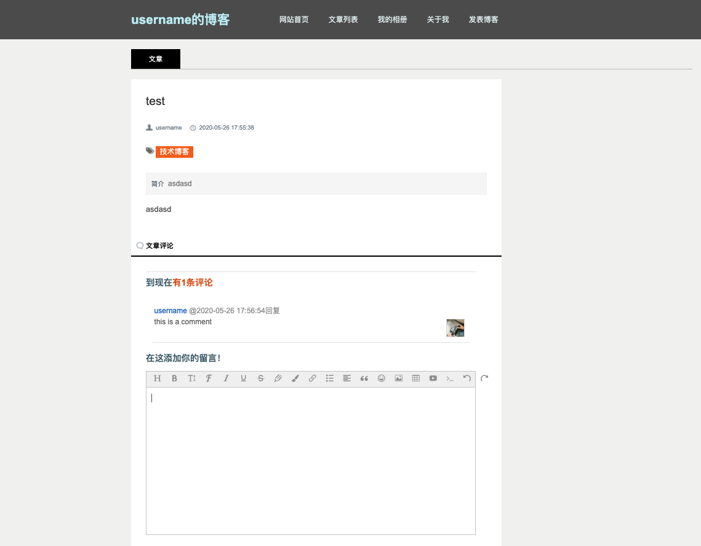

# Blog

In this project, I built an API using Python, Django and MySQL that can be easily connected to a frontend project. 

In the current version you can:
- user can create an account and login
- create an article, delete the article, update the article, view the article if you are logged in
- a user can comment on the article if they are logged in
- another user can reply to the user's comment if they are logged in
- a guest can browse the public part of the blog but cannot perform certain actions that require authentification

## Getting Started

`python3 manage.py runserver`

## Screenshots from my frontend project (not included)

